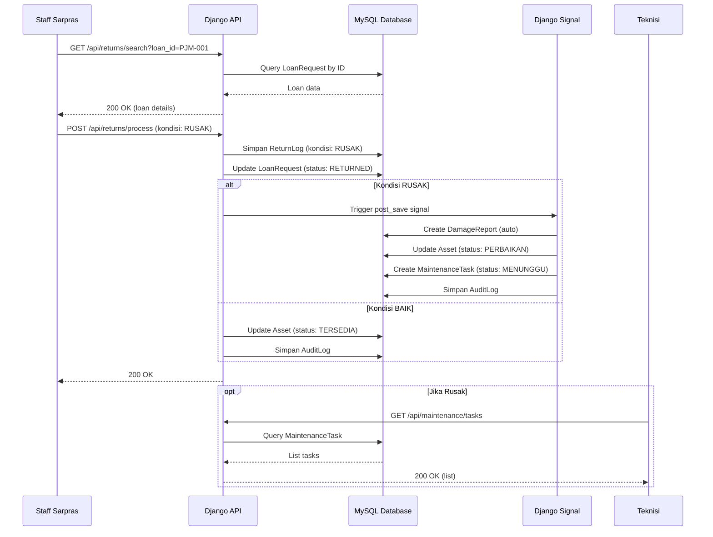
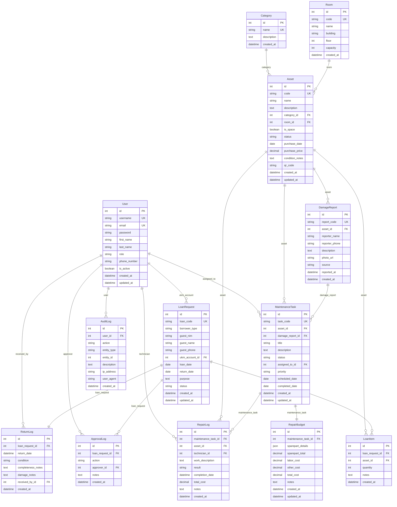

# Design Document: Backend API Django REST Framework untuk Smart-Inventory STTR

## Overview

Backend API ini dibangun menggunakan Django REST Framework (DRF) dengan database MySQL untuk sistem manajemen inventori kampus "Smart-Inventory STTR". Sistem ini mengelola aset kampus (barang dan ruangan), peminjaman oleh mahasiswa dan UKM, pengembalian dengan tracking kondisi, pelaporan kerusakan, dan pemeliharaan aset dengan anggaran perbaikan. Sistem mengimplementasikan role-based access control (RBAC) untuk 4 role: ADMIN, STAFF, TEKNISI, dan UKM.

Fitur utama meliputi:
- **Autentikasi & Otorisasi**: Login berbasis role dengan JWT token
- **Manajemen Aset**: CRUD aset (barang & ruangan), kategori, dan lokasi
- **Peminjaman**: Pengajuan peminjaman oleh Guest (NIM) atau UKM Account, approval workflow
- **Pengembalian**: Pencatatan pengembalian dengan kondisi aset, auto-create damage report jika rusak
- **Pemeliharaan**: Damage report, maintenance task, repair budget (sparepart & biaya jasa), repair log
- **Dashboard**: Summary statistik untuk monitoring
- **Audit Trail**: Logging aktivitas penting untuk compliance

## Arsitektur Sistem

```mermaid
graph TB
    subgraph "Frontend Layer"
        UI[React UI Dashboard]
    end
    
    subgraph "API Layer - Django REST Framework"
        API[REST API Endpoints]
        AUTH[Authentication JWT]
        PERM[Permission Classes]
    end
    
    subgraph "Business Logic Layer"
        VIEWS[ViewSets & APIViews]
        SERIALIZERS[Serializers]
        SIGNALS[Django Signals]
    end
    
    subgraph "Data Layer"
        MODELS[Django Models]
        MYSQL[(MySQL Database)]
    end
    
    subgraph "External Services"
        WA[WhatsApp Notification]
    end
    
    UI -->|HTTP/JSON| API
    API --> AUTH
    API --> PERM
    API --> VIEWS
    VIEWS --> SERIALIZERS
    SERIALIZERS --> MODELS
    MODELS --> MYSQL
    VIEWS --> SIGNALS
    SIGNALS --> WA
    
    style UI fill:#e1f5ff
    style API fill:#fff4e1
    style MYSQL fill:#ffe1e1


## Alur Utama Sistem

### Sequence Diagram: Alur Peminjaman Aset

```mermaid
sequenceDiagram
    participant M as Mahasiswa/UKM
    participant API as Django API
    participant DB as MySQL Database
    participant STAFF as Staff Sarpras
    participant WA as WhatsApp Service
    
    M->>API: POST /api/loans/request (data peminjaman)
    API->>DB: Cek ketersediaan aset
    DB-->>API: Aset tersedia
    API->>DB: Simpan LoanRequest (status: PENDING)
    API->>DB: Simpan ApprovalLog (action: SUBMITTED)
    API->>DB: Simpan AuditLog
    API-->>M: 201 Created (loan_id)
    API->>WA: Notifikasi ke Staff
    
    STAFF->>API: GET /api/loans/approval-queue
    API->>DB: Query LoanRequest (status: PENDING)
    DB-->>API: List pending loans
    API-->>STAFF: 200 OK (list)
    
    STAFF->>API: POST /api/loans/{id}/approve
    API->>DB: Update LoanRequest (status: APPROVED)
    API->>DB: Update Asset (status: DIPINJAM)
    API->>DB: Simpan ApprovalLog (action: APPROVED)
    API->>DB: Simpan AuditLog
    API-->>STAFF: 200 OK
    API->>WA: Notifikasi ke Peminjam
```

### Sequence Diagram: Alur Pengembalian dengan Kondisi Rusak



## Model Data (Database Schema)

### 1. User & Authentication

#### Tabel: User (Django AbstractUser)
```python
class User(AbstractUser):
    """
    Model User dengan role-based access
    Extends Django AbstractUser untuk autentikasi
    """
    id = AutoField(primary_key=True)
    username = CharField(max_length=150, unique=True)
    email = EmailField(unique=True)
    password = CharField(max_length=128)  # Hashed
    first_name = CharField(max_length=150)
    last_name = CharField(max_length=150)
    role = CharField(max_length=20, choices=ROLE_CHOICES)
    # ROLE_CHOICES: ADMIN, STAFF, TEKNISI, UKM
    phone_number = CharField(max_length=20, null=True)
    is_active = BooleanField(default=True)
    created_at = DateTimeField(auto_now_add=True)
    updated_at = DateTimeField(auto_now=True)
```

**Relasi:**
- One-to-Many dengan LoanRequest (sebagai peminjam UKM)
- One-to-Many dengan ApprovalLog (sebagai approver)
- One-to-Many dengan ReturnLog (sebagai admin penerima)
- One-to-Many dengan MaintenanceTask (sebagai teknisi)
- One-to-Many dengan AuditLog (sebagai user yang melakukan aksi)

### 2. Aset Management

#### Tabel: Category
```python
class Category(models.Model):
    """
    Kategori aset (Elektronik, Furniture, Alat Lab, dll)
    """
    id = AutoField(primary_key=True)
    name = CharField(max_length=100, unique=True)
    description = TextField(null=True, blank=True)
    created_at = DateTimeField(auto_now_add=True)
```

**Relasi:**
- One-to-Many dengan Asset

#### Tabel: Room
```python
class Room(models.Model):
    """
    Lokasi/Ruangan tempat aset berada
    """
    id = AutoField(primary_key=True)
    code = CharField(max_length=50, unique=True)  # e.g., "A301", "Lab-Komputer-1"
    name = CharField(max_length=200)
    building = CharField(max_length=100)  # Gedung A, B, C, dll
    floor = IntegerField(null=True)
    capacity = IntegerField(null=True)  # Kapasitas ruangan
    created_at = DateTimeField(auto_now_add=True)
```

**Relasi:**
- One-to-Many dengan Asset

#### Tabel: Asset
```python
class Asset(models.Model):
    """
    Aset kampus (Barang & Ruangan)
    Field is_space membedakan antara barang fisik dan ruangan
    """
    id = AutoField(primary_key=True)
    code = CharField(max_length=50, unique=True)  # AST-2024-001
    name = CharField(max_length=200)
    description = TextField(null=True, blank=True)
    category = ForeignKey(Category, on_delete=PROTECT)
    room = ForeignKey(Room, on_delete=PROTECT, null=True)  # Lokasi aset
    is_space = BooleanField(default=False)  # True jika aset adalah ruangan
    status = CharField(max_length=20, choices=STATUS_CHOICES)
    # STATUS_CHOICES: TERSEDIA, DIPINJAM, PERBAIKAN, RUSAK
    purchase_date = DateField(null=True)
    purchase_price = DecimalField(max_digits=15, decimal_places=2, null=True)
    condition_notes = TextField(null=True, blank=True)
    qr_code = CharField(max_length=255, null=True)  # Path ke QR code image
    created_at = DateTimeField(auto_now_add=True)
    updated_at = DateTimeField(auto_now=True)
```

**Relasi:**
- Many-to-One dengan Category
- Many-to-One dengan Room
- One-to-Many dengan LoanItem
- One-to-Many dengan DamageReport
- One-to-Many dengan MaintenanceTask

### 3. Peminjaman

#### Tabel: LoanRequest
```python
class LoanRequest(models.Model):
    """
    Pengajuan peminjaman aset
    Mendukung Guest (NIM) dan UKM Account
    """
    id = AutoField(primary_key=True)
    loan_code = CharField(max_length=50, unique=True)  # PJM-2024-001
    
    # Peminjam bisa Guest (NIM) atau UKM Account
    borrower_type = CharField(max_length=20, choices=BORROWER_TYPE_CHOICES)
    # BORROWER_TYPE_CHOICES: GUEST, UKM
    
    # Untuk Guest (Mahasiswa)
    guest_nim = CharField(max_length=20, null=True, blank=True)
    guest_name = CharField(max_length=200, null=True, blank=True)
    guest_phone = CharField(max_length=20, null=True, blank=True)
    
    # Untuk UKM Account
    ukm_account = ForeignKey(User, on_delete=PROTECT, null=True, blank=True)
    
    loan_date = DateField()
    return_date = DateField()
    purpose = TextField()  # Keperluan peminjaman
    status = CharField(max_length=20, choices=LOAN_STATUS_CHOICES)
    # LOAN_STATUS_CHOICES: PENDING, APPROVED, REJECTED, RETURNED
    
    created_at = DateTimeField(auto_now_add=True)
    updated_at = DateTimeField(auto_now=True)
```

**Relasi:**
- Many-to-One dengan User (ukm_account, nullable)
- One-to-Many dengan LoanItem
- One-to-Many dengan ApprovalLog
- One-to-One dengan ReturnLog

**Constraints:**
- Jika borrower_type = GUEST, maka guest_nim, guest_name, guest_phone harus diisi
- Jika borrower_type = UKM, maka ukm_account harus diisi

#### Tabel: LoanItem
```python
class LoanItem(models.Model):
    """
    Item aset yang dipinjam dalam satu LoanRequest
    Satu peminjaman bisa meminjam multiple aset
    """
    id = AutoField(primary_key=True)
    loan_request = ForeignKey(LoanRequest, on_delete=CASCADE, related_name='items')
    asset = ForeignKey(Asset, on_delete=PROTECT)
    quantity = IntegerField(default=1)  # Untuk aset yang bisa dipinjam multiple
    notes = TextField(null=True, blank=True)
    created_at = DateTimeField(auto_now_add=True)
```

**Relasi:**
- Many-to-One dengan LoanRequest
- Many-to-One dengan Asset

#### Tabel: ApprovalLog
```python
class ApprovalLog(models.Model):
    """
    Log approval/rejection peminjaman
    Tracking siapa yang approve/reject dan kapan
    """
    id = AutoField(primary_key=True)
    loan_request = ForeignKey(LoanRequest, on_delete=CASCADE, related_name='approval_logs')
    action = CharField(max_length=20, choices=ACTION_CHOICES)
    # ACTION_CHOICES: SUBMITTED, APPROVED, REJECTED
    approver = ForeignKey(User, on_delete=PROTECT, null=True)  # Staff yang approve
    notes = TextField(null=True, blank=True)  # Alasan reject
    created_at = DateTimeField(auto_now_add=True)
```

**Relasi:**
- Many-to-One dengan LoanRequest
- Many-to-One dengan User (approver)

### 4. Pengembalian

#### Tabel: ReturnLog
```python
class ReturnLog(models.Model):
    """
    Log pengembalian aset
    Mencatat tanggal kembali, kondisi, dan admin penerima
    """
    id = AutoField(primary_key=True)
    loan_request = OneToOneField(LoanRequest, on_delete=PROTECT)
    return_date = DateTimeField(auto_now_add=True)
    condition = CharField(max_length=20, choices=CONDITION_CHOICES)
    # CONDITION_CHOICES: BAIK, RUSAK
    completeness_notes = TextField(null=True, blank=True)  # Checklist kelengkapan
    damage_notes = TextField(null=True, blank=True)  # Catatan kerusakan jika ada
    received_by = ForeignKey(User, on_delete=PROTECT)  # Admin/Staff penerima
    created_at = DateTimeField(auto_now_add=True)
```

**Relasi:**
- One-to-One dengan LoanRequest
- Many-to-One dengan User (received_by)

### 5. Pemeliharaan

#### Tabel: DamageReport
```python
class DamageReport(models.Model):
    """
    Laporan kerusakan aset
    Bisa dibuat manual atau auto-generated dari pengembalian rusak
    """
    id = AutoField(primary_key=True)
    report_code = CharField(max_length=50, unique=True)  # DMG-2024-001
    asset = ForeignKey(Asset, on_delete=PROTECT)
    reporter_name = CharField(max_length=200)
    reporter_phone = CharField(max_length=20, null=True)
    description = TextField()  # Deskripsi kerusakan
    photo_url = CharField(max_length=500, null=True)  # Path ke foto bukti
    source = CharField(max_length=20, choices=SOURCE_CHOICES)
    # SOURCE_CHOICES: MANUAL, AUTO_RETURN
    reported_at = DateTimeField(auto_now_add=True)
    created_at = DateTimeField(auto_now_add=True)
```

**Relasi:**
- Many-to-One dengan Asset

#### Tabel: MaintenanceTask
```python
class MaintenanceTask(models.Model):
    """
    Task pemeliharaan/perbaikan aset
    Status: MENUNGGU, PROSES, SELESAI
    """
    id = AutoField(primary_key=True)
    task_code = CharField(max_length=50, unique=True)  # MNT-2024-001
    asset = ForeignKey(Asset, on_delete=PROTECT)
    damage_report = ForeignKey(DamageReport, on_delete=SET_NULL, null=True)
    title = CharField(max_length=200)
    description = TextField()
    status = CharField(max_length=20, choices=TASK_STATUS_CHOICES)
    # TASK_STATUS_CHOICES: MENUNGGU, PROSES, SELESAI
    assigned_to = ForeignKey(User, on_delete=SET_NULL, null=True)  # Teknisi
    priority = CharField(max_length=20, choices=PRIORITY_CHOICES)
    # PRIORITY_CHOICES: LOW, MEDIUM, HIGH, URGENT
    scheduled_date = DateField(null=True)
    completed_date = DateField(null=True)
    created_at = DateTimeField(auto_now_add=True)
    updated_at = DateTimeField(auto_now=True)
```

**Relasi:**
- Many-to-One dengan Asset
- Many-to-One dengan DamageReport (nullable)
- Many-to-One dengan User (assigned_to, teknisi)
- One-to-One dengan RepairBudget

#### Tabel: RepairBudget
```python
class RepairBudget(models.Model):
    """
    Detail anggaran perbaikan
    Mencatat sparepart dan biaya jasa
    """
    id = AutoField(primary_key=True)
    maintenance_task = OneToOneField(MaintenanceTask, on_delete=CASCADE)
    sparepart_details = JSONField()  # Array of {name, qty, unit_price, total}
    # Example: [{"name": "Lampu LED", "qty": 2, "unit_price": 50000, "total": 100000}]
    sparepart_total = DecimalField(max_digits=15, decimal_places=2)
    labor_cost = DecimalField(max_digits=15, decimal_places=2)
    other_cost = DecimalField(max_digits=15, decimal_places=2, default=0)
    total_cost = DecimalField(max_digits=15, decimal_places=2)
    notes = TextField(null=True, blank=True)
    created_at = DateTimeField(auto_now_add=True)
    updated_at = DateTimeField(auto_now=True)
```

**Relasi:**
- One-to-One dengan MaintenanceTask

#### Tabel: RepairLog
```python
class RepairLog(models.Model):
    """
    Riwayat final perbaikan
    Dibuat ketika MaintenanceTask selesai
    """
    id = AutoField(primary_key=True)
    maintenance_task = ForeignKey(MaintenanceTask, on_delete=PROTECT)
    asset = ForeignKey(Asset, on_delete=PROTECT)
    technician = ForeignKey(User, on_delete=PROTECT)
    work_description = TextField()  # Deskripsi pekerjaan yang dilakukan
    result = CharField(max_length=20, choices=RESULT_CHOICES)
    # RESULT_CHOICES: SUCCESS, PARTIAL, FAILED
    completion_date = DateTimeField()
    total_cost = DecimalField(max_digits=15, decimal_places=2)
    notes = TextField(null=True, blank=True)
    created_at = DateTimeField(auto_now_add=True)
```

**Relasi:**
- Many-to-One dengan MaintenanceTask
- Many-to-One dengan Asset
- Many-to-One dengan User (technician)

### 6. Sistem

#### Tabel: AuditLog
```python
class AuditLog(models.Model):
    """
    Audit trail untuk tracking aktivitas penting
    """
    id = AutoField(primary_key=True)
    user = ForeignKey(User, on_delete=SET_NULL, null=True)
    action = CharField(max_length=50)  # CREATE_LOAN, APPROVE_LOAN, RETURN_ASSET, dll
    entity_type = CharField(max_length=50)  # LoanRequest, Asset, MaintenanceTask, dll
    entity_id = IntegerField()
    description = TextField()
    ip_address = GenericIPAddressField(null=True)
    user_agent = CharField(max_length=500, null=True)
    created_at = DateTimeField(auto_now_add=True)
```

**Relasi:**
- Many-to-One dengan User (nullable)

## Entity Relationship Diagram




## API Endpoints

### Base URL
```
http://localhost:8000/api/v1
```

### Authentication Endpoints

#### 1. Login
```
POST /auth/login
```

**Request Body:**
```json
{
  "username": "admin_user",
  "password": "password123"
}
```

**Response (200 OK):**
```json
{
  "access": "eyJ0eXAiOiJKV1QiLCJhbGc...",
  "refresh": "eyJ0eXAiOiJKV1QiLCJhbGc...",
  "user": {
    "id": 1,
    "username": "admin_user",
    "email": "admin@sttr.ac.id",
    "first_name": "Admin",
    "last_name": "User",
    "role": "ADMIN",
    "phone_number": "081234567890"
  }
}
```

**Response (401 Unauthorized):**
```json
{
  "detail": "Username atau password salah"
}
```

#### 2. Refresh Token
```
POST /auth/refresh
```

**Request Body:**
```json
{
  "refresh": "eyJ0eXAiOiJKV1QiLCJhbGc..."
}
```

**Response (200 OK):**
```json
{
  "access": "eyJ0eXAiOiJKV1QiLCJhbGc..."
}
```

#### 3. Logout
```
POST /auth/logout
```

**Request Body:**
```json
{
  "refresh": "eyJ0eXAiOiJKV1QiLCJhbGc..."
}
```

**Response (200 OK):**
```json
{
  "detail": "Logout berhasil"
}
```

### Dashboard Endpoints

#### 1. Get Dashboard Summary
```
GET /dashboard/summary
```

**Permission:** Authenticated (ADMIN, STAFF, TEKNISI)

**Response (200 OK):**
```json
{
  "total_assets": 1247,
  "damaged_assets": 23,
  "borrowed_assets": 156,
  "scheduled_maintenance_this_week": 8,
  "pending_loan_requests": 4,
  "active_maintenance_tasks": 12,
  "recent_damage_reports": [
    {
      "id": 1,
      "report_code": "DMG-2024-001",
      "asset_name": "Kursi Kelas D102",
      "reporter_name": "Ahmad Fauzi",
      "reported_at": "2026-04-12T10:30:00Z",
      "status": "MENUNGGU"
    }
  ],
  "upcoming_services": [
    {
      "id": 1,
      "task_code": "MNT-2024-001",
      "asset_name": "Proyektor Ruang A301",
      "scheduled_date": "2026-04-14",
      "type": "Servis Rutin"
    }
  ]
}
```

### User Management Endpoints

#### 1. Create User (UKM/Staff)
```
POST /users
```

**Permission:** ADMIN only

**Request Body (UKM):**
```json
{
  "username": "ukm_musik",
  "email": "ukm.musik@sttr.ac.id",
  "first_name": "UKM",
  "last_name": "Musik STTR",
  "role": "UKM",
  "phone_number": "081234567890",
  "password": "auto_generated_12char"
}
```

**Request Body (Staff/Teknisi):**
```json
{
  "username": "bambang.staff",
  "email": "bambang@sttr.ac.id",
  "first_name": "Bambang",
  "last_name": "Sutrisno",
  "role": "STAFF",
  "phone_number": "081234567891",
  "password": "auto_generated_12char"
}
```

**Response (201 Created):**
```json
{
  "id": 5,
  "username": "ukm_musik",
  "email": "ukm.musik@sttr.ac.id",
  "first_name": "UKM",
  "last_name": "Musik STTR",
  "role": "UKM",
  "phone_number": "081234567890",
  "is_active": true,
  "created_at": "2026-04-13T10:00:00Z",
  "credentials": {
    "username": "ukm_musik",
    "password": "auto_generated_12char"
  }
}
```

#### 2. List Users
```
GET /users?role=UKM
GET /users?role=STAFF
GET /users?role=TEKNISI
```

**Permission:** ADMIN only

**Response (200 OK):**
```json
{
  "count": 2,
  "results": [
    {
      "id": 5,
      "username": "ukm_musik",
      "email": "ukm.musik@sttr.ac.id",
      "first_name": "UKM",
      "last_name": "Musik STTR",
      "role": "UKM",
      "phone_number": "081234567890",
      "is_active": true,
      "created_at": "2026-04-13T10:00:00Z"
    }
  ]
}
```

#### 3. Delete User
```
DELETE /users/{id}
```

**Permission:** ADMIN only

**Response (204 No Content)**

### Asset Management Endpoints

#### 1. List Assets
```
GET /assets?category=Elektronik&status=TERSEDIA&search=proyektor
```

**Permission:** Authenticated

**Response (200 OK):**
```json
{
  "count": 10,
  "next": null,
  "previous": null,
  "results": [
    {
      "id": 1,
      "code": "AST-2024-001",
      "name": "Proyektor Epson EB-X41",
      "description": "Proyektor portable untuk presentasi",
      "category": {
        "id": 1,
        "name": "Elektronik"
      },
      "room": {
        "id": 1,
        "code": "A301",
        "name": "Ruang A301",
        "building": "Gedung A"
      },
      "is_space": false,
      "status": "TERSEDIA",
      "purchase_date": "2024-01-15",
      "purchase_price": "5000000.00",
      "qr_code": "/media/qr_codes/AST-2024-001.png",
      "created_at": "2024-01-15T08:00:00Z"
    }
  ]
}
```

#### 2. Get Asset Detail
```
GET /assets/{id}
```

**Permission:** Authenticated

**Response (200 OK):**
```json
{
  "id": 1,
  "code": "AST-2024-001",
  "name": "Proyektor Epson EB-X41",
  "description": "Proyektor portable untuk presentasi",
  "category": {
    "id": 1,
    "name": "Elektronik"
  },
  "room": {
    "id": 1,
    "code": "A301",
    "name": "Ruang A301",
    "building": "Gedung A"
  },
  "is_space": false,
  "status": "TERSEDIA",
  "purchase_date": "2024-01-15",
  "purchase_price": "5000000.00",
  "condition_notes": "Kondisi baik, lampu masih 500 jam",
  "qr_code": "/media/qr_codes/AST-2024-001.png",
  "created_at": "2024-01-15T08:00:00Z",
  "updated_at": "2026-04-13T10:00:00Z"
}
```

### Loan Request Endpoints

#### 1. Create Loan Request (Guest - Mahasiswa)
```
POST /loans/request
```

**Permission:** Public (no auth required for guest)

**Request Body:**
```json
{
  "borrower_type": "GUEST",
  "guest_nim": "210401001",
  "guest_name": "Ahmad Fauzi",
  "guest_phone": "081234567890",
  "loan_date": "2026-04-15",
  "return_date": "2026-04-17",
  "purpose": "Presentasi Tugas Akhir di Ruang Seminar",
  "items": [
    {
      "asset_id": 1,
      "quantity": 1,
      "notes": "Butuh kabel HDMI juga"
    }
  ]
}
```

**Response (201 Created):**
```json
{
  "id": 1,
  "loan_code": "PJM-2024-001",
  "borrower_type": "GUEST",
  "guest_nim": "210401001",
  "guest_name": "Ahmad Fauzi",
  "guest_phone": "081234567890",
  "loan_date": "2026-04-15",
  "return_date": "2026-04-17",
  "purpose": "Presentasi Tugas Akhir di Ruang Seminar",
  "status": "PENDING",
  "items": [
    {
      "id": 1,
      "asset": {
        "id": 1,
        "code": "AST-2024-001",
        "name": "Proyektor Epson EB-X41"
      },
      "quantity": 1,
      "notes": "Butuh kabel HDMI juga"
    }
  ],
  "created_at": "2026-04-13T10:30:00Z"
}
```

#### 2. Create Loan Request (UKM Account)
```
POST /loans/request
```

**Permission:** Authenticated (UKM role)

**Request Body:**
```json
{
  "borrower_type": "UKM",
  "loan_date": "2026-04-14",
  "return_date": "2026-04-14",
  "purpose": "Turnamen Futsal Antar Fakultas",
  "items": [
    {
      "asset_id": 5,
      "quantity": 3,
      "notes": null
    }
  ]
}
```

**Response (201 Created):**
```json
{
  "id": 2,
  "loan_code": "PJM-2024-002",
  "borrower_type": "UKM",
  "ukm_account": {
    "id": 5,
    "username": "ukm_olahraga",
    "first_name": "UKM",
    "last_name": "Olahraga"
  },
  "loan_date": "2026-04-14",
  "return_date": "2026-04-14",
  "purpose": "Turnamen Futsal Antar Fakultas",
  "status": "PENDING",
  "items": [
    {
      "id": 2,
      "asset": {
        "id": 5,
        "code": "AST-2024-005",
        "name": "Bola Futsal"
      },
      "quantity": 3,
      "notes": null
    }
  ],
  "created_at": "2026-04-13T09:15:00Z"
}
```

#### 3. Get Approval Queue
```
GET /loans/approval-queue?status=PENDING
```

**Permission:** ADMIN, STAFF

**Response (200 OK):**
```json
{
  "count": 4,
  "results": [
    {
      "id": 1,
      "loan_code": "PJM-2024-001",
      "borrower_type": "GUEST",
      "guest_nim": "210401001",
      "guest_name": "Ahmad Fauzi",
      "guest_phone": "081234567890",
      "loan_date": "2026-04-15",
      "return_date": "2026-04-17",
      "purpose": "Presentasi Tugas Akhir di Ruang Seminar",
      "status": "PENDING",
      "items": [
        {
          "asset": {
            "code": "AST-2024-001",
            "name": "Proyektor Epson EB-X41"
          },
          "quantity": 1
        }
      ],
      "created_at": "2026-04-13T10:30:00Z"
    }
  ]
}
```

#### 4. Approve Loan Request
```
POST /loans/{id}/approve
```

**Permission:** ADMIN, STAFF

**Request Body:**
```json
{
  "notes": "Disetujui, silakan ambil di ruang sarpras"
}
```

**Response (200 OK):**
```json
{
  "id": 1,
  "loan_code": "PJM-2024-001",
  "status": "APPROVED",
  "approval_log": {
    "action": "APPROVED",
    "approver": {
      "id": 2,
      "username": "bambang.staff",
      "first_name": "Bambang",
      "last_name": "Sutrisno"
    },
    "notes": "Disetujui, silakan ambil di ruang sarpras",
    "created_at": "2026-04-13T11:00:00Z"
  }
}
```

#### 5. Reject Loan Request
```
POST /loans/{id}/reject
```

**Permission:** ADMIN, STAFF

**Request Body:**
```json
{
  "notes": "Aset sedang dalam perbaikan"
}
```

**Response (200 OK):**
```json
{
  "id": 1,
  "loan_code": "PJM-2024-001",
  "status": "REJECTED",
  "approval_log": {
    "action": "REJECTED",
    "approver": {
      "id": 2,
      "username": "bambang.staff",
      "first_name": "Bambang",
      "last_name": "Sutrisno"
    },
    "notes": "Aset sedang dalam perbaikan",
    "created_at": "2026-04-13T11:00:00Z"
  }
}
```

### Return Endpoints

#### 1. Search Loan by ID or NIM
```
GET /returns/search?loan_id=PJM-2024-001
GET /returns/search?nim=210401001
```

**Permission:** ADMIN, STAFF

**Response (200 OK):**
```json
{
  "id": 1,
  "loan_code": "PJM-2024-001",
  "borrower_type": "GUEST",
  "guest_nim": "210401001",
  "guest_name": "Ahmad Fauzi",
  "guest_phone": "081234567890",
  "loan_date": "2026-04-15",
  "return_date": "2026-04-17",
  "status": "APPROVED",
  "items": [
    {
      "id": 1,
      "asset": {
        "id": 1,
        "code": "AST-2024-001",
        "name": "Proyektor Epson EB-X41"
      },
      "quantity": 1
    }
  ]
}
```

**Response (404 Not Found):**
```json
{
  "detail": "Data peminjaman tidak ditemukan"
}
```

#### 2. Process Return
```
POST /returns/process
```

**Permission:** ADMIN, STAFF

**Request Body (Kondisi Baik):**
```json
{
  "loan_request_id": 1,
  "condition": "BAIK",
  "completeness_notes": "Semua kelengkapan lengkap: kabel, adaptor, tas, manual",
  "damage_notes": null
}
```

**Response (200 OK - Kondisi Baik):**
```json
{
  "id": 1,
  "loan_request": {
    "id": 1,
    "loan_code": "PJM-2024-001"
  },
  "return_date": "2026-04-17T14:30:00Z",
  "condition": "BAIK",
  "completeness_notes": "Semua kelengkapan lengkap: kabel, adaptor, tas, manual",
  "damage_notes": null,
  "received_by": {
    "id": 2,
    "username": "bambang.staff",
    "first_name": "Bambang",
    "last_name": "Sutrisno"
  },
  "asset_status_updated": "TERSEDIA",
  "message": "Pengembalian berhasil dikonfirmasi. Status aset diperbarui menjadi TERSEDIA."
}
```

**Request Body (Kondisi Rusak):**
```json
{
  "loan_request_id": 1,
  "condition": "RUSAK",
  "completeness_notes": "Kabel HDMI hilang",
  "damage_notes": "Lensa proyektor retak, tidak bisa fokus"
}
```

**Response (200 OK - Kondisi Rusak):**
```json
{
  "id": 1,
  "loan_request": {
    "id": 1,
    "loan_code": "PJM-2024-001"
  },
  "return_date": "2026-04-17T14:30:00Z",
  "condition": "RUSAK",
  "completeness_notes": "Kabel HDMI hilang",
  "damage_notes": "Lensa proyektor retak, tidak bisa fokus",
  "received_by": {
    "id": 2,
    "username": "bambang.staff",
    "first_name": "Bambang",
    "last_name": "Sutrisno"
  },
  "asset_status_updated": "PERBAIKAN",
  "damage_report_created": {
    "id": 5,
    "report_code": "DMG-2024-005",
    "source": "AUTO_RETURN"
  },
  "maintenance_task_created": {
    "id": 8,
    "task_code": "MNT-2024-008",
    "status": "MENUNGGU"
  },
  "message": "Pengembalian berhasil dikonfirmasi. Aset rusak, otomatis membuat laporan kerusakan dan task pemeliharaan."
}
```

### Damage Report Endpoints

#### 1. Create Damage Report (Manual)
```
POST /damage-reports
```

**Permission:** Authenticated

**Request Body:**
```json
{
  "asset_id": 2,
  "reporter_name": "Ahmad Fauzi",
  "reporter_phone": "081234567890",
  "description": "Kaki kursi patah dan tidak stabil ketika diduduki",
  "photo_url": "/media/damage_photos/kursi_rusak_001.jpg"
}
```

**Response (201 Created):**
```json
{
  "id": 1,
  "report_code": "DMG-2024-001",
  "asset": {
    "id": 2,
    "code": "AST-2024-002",
    "name": "Kursi Kuliah Lipat"
  },
  "reporter_name": "Ahmad Fauzi",
  "reporter_phone": "081234567890",
  "description": "Kaki kursi patah dan tidak stabil ketika diduduki",
  "photo_url": "/media/damage_photos/kursi_rusak_001.jpg",
  "source": "MANUAL",
  "reported_at": "2026-04-12T10:30:00Z",
  "created_at": "2026-04-12T10:30:00Z"
}
```

#### 2. List Damage Reports
```
GET /damage-reports?status=MENUNGGU
```

**Permission:** ADMIN, STAFF, TEKNISI

**Response (200 OK):**
```json
{
  "count": 3,
  "results": [
    {
      "id": 1,
      "report_code": "DMG-2024-001",
      "asset": {
        "code": "AST-2024-002",
        "name": "Kursi Kuliah Lipat",
        "room": "Ruang D102"
      },
      "reporter_name": "Ahmad Fauzi",
      "description": "Kaki kursi patah dan tidak stabil ketika diduduki",
      "source": "MANUAL",
      "reported_at": "2026-04-12T10:30:00Z"
    }
  ]
}
```

### Maintenance Task Endpoints

#### 1. List Maintenance Tasks
```
GET /maintenance/tasks?status=MENUNGGU
GET /maintenance/tasks?status=PROSES
GET /maintenance/tasks?status=SELESAI
```

**Permission:** ADMIN, STAFF, TEKNISI

**Response (200 OK):**
```json
{
  "count": 2,
  "results": [
    {
      "id": 1,
      "task_code": "MNT-2024-001",
      "asset": {
        "id": 2,
        "code": "AST-2024-002",
        "name": "Kursi Kuliah Lipat",
        "room": "Ruang D102"
      },
      "damage_report": {
        "id": 1,
        "report_code": "DMG-2024-001"
      },
      "title": "Perbaikan Kaki Kursi Patah",
      "description": "Kaki kursi patah dan tidak stabil ketika diduduki",
      "status": "MENUNGGU",
      "assigned_to": null,
      "priority": "MEDIUM",
      "scheduled_date": null,
      "created_at": "2026-04-12T10:35:00Z"
    }
  ]
}
```

#### 2. Start Maintenance Task
```
POST /maintenance/tasks/{id}/start
```

**Permission:** ADMIN, STAFF, TEKNISI

**Request Body:**
```json
{
  "assigned_to_id": 3,
  "scheduled_date": "2026-04-14"
}
```

**Response (200 OK):**
```json
{
  "id": 1,
  "task_code": "MNT-2024-001",
  "status": "PROSES",
  "assigned_to": {
    "id": 3,
    "username": "dewi.teknisi",
    "first_name": "Dewi",
    "last_name": "Lestari"
  },
  "scheduled_date": "2026-04-14",
  "updated_at": "2026-04-13T11:00:00Z"
}
```

#### 3. Complete Maintenance Task with Budget
```
POST /maintenance/tasks/{id}/complete
```

**Permission:** ADMIN, STAFF, TEKNISI

**Request Body:**
```json
{
  "sparepart_details": [
    {
      "name": "Baut M8 x 50mm",
      "qty": 4,
      "unit_price": 5000,
      "total": 20000
    },
    {
      "name": "Kaki Kursi Besi",
      "qty": 1,
      "unit_price": 50000,
      "total": 50000
    }
  ],
  "sparepart_total": 70000,
  "labor_cost": 30000,
  "other_cost": 0,
  "total_cost": 100000,
  "work_description": "Mengganti kaki kursi yang patah dengan yang baru, memasang baut penguat",
  "result": "SUCCESS",
  "notes": "Kursi sudah diperbaiki dan ditest, kondisi stabil"
}
```

**Response (200 OK):**
```json
{
  "maintenance_task": {
    "id": 1,
    "task_code": "MNT-2024-001",
    "status": "SELESAI",
    "completed_date": "2026-04-14"
  },
  "repair_budget": {
    "id": 1,
    "sparepart_details": [
      {
        "name": "Baut M8 x 50mm",
        "qty": 4,
        "unit_price": 5000,
        "total": 20000
      },
      {
        "name": "Kaki Kursi Besi",
        "qty": 1,
        "unit_price": 50000,
        "total": 50000
      }
    ],
    "sparepart_total": "70000.00",
    "labor_cost": "30000.00",
    "other_cost": "0.00",
    "total_cost": "100000.00"
  },
  "repair_log": {
    "id": 1,
    "maintenance_task_id": 1,
    "technician": {
      "id": 3,
      "username": "dewi.teknisi",
      "first_name": "Dewi",
      "last_name": "Lestari"
    },
    "work_description": "Mengganti kaki kursi yang patah dengan yang baru, memasang baut penguat",
    "result": "SUCCESS",
    "completion_date": "2026-04-14T16:00:00Z",
    "total_cost": "100000.00"
  },
  "asset_status_updated": "TERSEDIA",
  "message": "Task pemeliharaan selesai. Anggaran dan log perbaikan telah dicatat. Status aset diperbarui menjadi TERSEDIA."
}
```

### Audit Log Endpoints

#### 1. List Audit Logs
```
GET /audit-logs?action=APPROVE_LOAN&entity_type=LoanRequest&start_date=2026-04-01&end_date=2026-04-30
```

**Permission:** ADMIN only

**Response (200 OK):**
```json
{
  "count": 15,
  "results": [
    {
      "id": 1,
      "user": {
        "id": 2,
        "username": "bambang.staff",
        "first_name": "Bambang",
        "last_name": "Sutrisno"
      },
      "action": "APPROVE_LOAN",
      "entity_type": "LoanRequest",
      "entity_id": 1,
      "description": "Menyetujui peminjaman PJM-2024-001 oleh Ahmad Fauzi",
      "ip_address": "192.168.1.100",
      "user_agent": "Mozilla/5.0...",
      "created_at": "2026-04-13T11:00:00Z"
    }
  ]
}
```


## Algoritma Kunci Sistem

### Algoritma 1: Proses Pengembalian Aset dengan Auto-Create Damage Report

```python
def process_return(loan_request_id, condition, completeness_notes, damage_notes, received_by_user):
    """
    Algoritma untuk memproses pengembalian aset
    
    Preconditions:
    - loan_request_id adalah ID valid dari LoanRequest dengan status APPROVED
    - condition adalah salah satu dari: BAIK, RUSAK
    - received_by_user adalah User dengan role ADMIN atau STAFF
    - LoanRequest belum memiliki ReturnLog (belum pernah dikembalikan)
    
    Postconditions:
    - ReturnLog dibuat dengan data pengembalian
    - LoanRequest.status diupdate menjadi RETURNED
    - Jika condition = RUSAK:
      - DamageReport dibuat otomatis dengan source AUTO_RETURN
      - Asset.status diupdate menjadi PERBAIKAN
      - MaintenanceTask dibuat dengan status MENUNGGU
    - Jika condition = BAIK:
      - Asset.status diupdate menjadi TERSEDIA
    - AuditLog dicatat untuk tracking
    - Return response dengan detail pengembalian
    """
    
    # Step 1: Validasi loan request
    try:
        loan_request = LoanRequest.objects.get(id=loan_request_id)
    except LoanRequest.DoesNotExist:
        raise ValidationError("Data peminjaman tidak ditemukan")
    
    if loan_request.status != "APPROVED":
        raise ValidationError("Peminjaman belum disetujui atau sudah dikembalikan")
    
    if hasattr(loan_request, 'return_log'):
        raise ValidationError("Peminjaman sudah pernah dikembalikan")
    
    # Step 2: Buat ReturnLog
    return_log = ReturnLog.objects.create(
        loan_request=loan_request,
        condition=condition,
        completeness_notes=completeness_notes,
        damage_notes=damage_notes,
        received_by=received_by_user
    )
    
    # Step 3: Update status LoanRequest
    loan_request.status = "RETURNED"
    loan_request.save()
    
    # Step 4: Proses berdasarkan kondisi
    response_data = {
        "return_log": return_log,
        "loan_request": loan_request
    }
    
    if condition == "RUSAK":
        # Step 4a: Proses kondisi RUSAK
        
        # Ambil semua aset yang dipinjam
        loan_items = loan_request.items.all()
        
        for loan_item in loan_items:
            asset = loan_item.asset
            
            # Create DamageReport otomatis
            damage_report = DamageReport.objects.create(
                report_code=generate_damage_report_code(),
                asset=asset,
                reporter_name=received_by_user.get_full_name(),
                reporter_phone=received_by_user.phone_number,
                description=f"Kerusakan ditemukan saat pengembalian: {damage_notes}",
                source="AUTO_RETURN",
                reported_at=timezone.now()
            )
            
            # Update status aset menjadi PERBAIKAN
            asset.status = "PERBAIKAN"
            asset.save()
            
            # Create MaintenanceTask otomatis
            maintenance_task = MaintenanceTask.objects.create(
                task_code=generate_maintenance_task_code(),
                asset=asset,
                damage_report=damage_report,
                title=f"Perbaikan {asset.name}",
                description=damage_notes,
                status="MENUNGGU",
                priority="MEDIUM"
            )
            
            # Catat di AuditLog
            AuditLog.objects.create(
                user=received_by_user,
                action="CREATE_DAMAGE_REPORT_AUTO",
                entity_type="DamageReport",
                entity_id=damage_report.id,
                description=f"Auto-create damage report {damage_report.report_code} dari pengembalian {loan_request.loan_code}"
            )
            
            response_data["damage_report_created"] = damage_report
            response_data["maintenance_task_created"] = maintenance_task
            response_data["asset_status_updated"] = "PERBAIKAN"
    
    else:  # condition == "BAIK"
        # Step 4b: Proses kondisi BAIK
        
        # Ambil semua aset yang dipinjam
        loan_items = loan_request.items.all()
        
        for loan_item in loan_items:
            asset = loan_item.asset
            
            # Update status aset menjadi TERSEDIA
            asset.status = "TERSEDIA"
            asset.save()
        
        response_data["asset_status_updated"] = "TERSEDIA"
    
    # Step 5: Catat di AuditLog
    AuditLog.objects.create(
        user=received_by_user,
        action="PROCESS_RETURN",
        entity_type="ReturnLog",
        entity_id=return_log.id,
        description=f"Memproses pengembalian {loan_request.loan_code} dengan kondisi {condition}"
    )
    
    return response_data
```

**Formal Specifications:**

**Preconditions:**
- `loan_request_id ∈ ℕ` dan `∃ loan ∈ LoanRequest : loan.id = loan_request_id`
- `loan.status = "APPROVED"`
- `¬∃ return_log ∈ ReturnLog : return_log.loan_request_id = loan_request_id`
- `condition ∈ {"BAIK", "RUSAK"}`
- `received_by_user.role ∈ {"ADMIN", "STAFF"}`

**Postconditions:**
- `∃ return_log ∈ ReturnLog : return_log.loan_request_id = loan_request_id`
- `loan.status = "RETURNED"`
- `condition = "RUSAK" ⟹ (∃ damage_report ∈ DamageReport : damage_report.source = "AUTO_RETURN" ∧ ∃ task ∈ MaintenanceTask : task.damage_report_id = damage_report.id ∧ ∀ asset ∈ loan.items : asset.status = "PERBAIKAN")`
- `condition = "BAIK" ⟹ (∀ asset ∈ loan.items : asset.status = "TERSEDIA")`
- `∃ audit_log ∈ AuditLog : audit_log.action = "PROCESS_RETURN" ∧ audit_log.entity_id = return_log.id`

**Loop Invariants:**
- Untuk setiap iterasi `loan_item` dalam `loan_items`:
  - Semua `loan_item` yang sudah diproses memiliki `asset.status` yang valid
  - Jika `condition = "RUSAK"`, setiap `asset` yang sudah diproses memiliki `DamageReport` dan `MaintenanceTask` terkait

### Algoritma 2: Approval Workflow untuk Loan Request

```python
def approve_loan_request(loan_request_id, approver_user, notes=None):
    """
    Algoritma untuk menyetujui peminjaman aset
    
    Preconditions:
    - loan_request_id adalah ID valid dari LoanRequest dengan status PENDING
    - approver_user adalah User dengan role ADMIN atau STAFF
    - Semua aset yang dipinjam memiliki status TERSEDIA
    
    Postconditions:
    - LoanRequest.status diupdate menjadi APPROVED
    - ApprovalLog dibuat dengan action APPROVED
    - Semua Asset yang dipinjam diupdate status menjadi DIPINJAM
    - AuditLog dicatat
    - Notifikasi WhatsApp dikirim ke peminjam
    - Return response dengan detail approval
    """
    
    # Step 1: Validasi loan request
    try:
        loan_request = LoanRequest.objects.get(id=loan_request_id)
    except LoanRequest.DoesNotExist:
        raise ValidationError("Data peminjaman tidak ditemukan")
    
    if loan_request.status != "PENDING":
        raise ValidationError("Peminjaman sudah diproses sebelumnya")
    
    # Step 2: Validasi ketersediaan aset
    loan_items = loan_request.items.all()
    
    for loan_item in loan_items:
        asset = loan_item.asset
        if asset.status != "TERSEDIA":
            raise ValidationError(f"Aset {asset.name} tidak tersedia (status: {asset.status})")
    
    # Step 3: Update status loan request
    loan_request.status = "APPROVED"
    loan_request.save()
    
    # Step 4: Buat ApprovalLog
    approval_log = ApprovalLog.objects.create(
        loan_request=loan_request,
        action="APPROVED",
        approver=approver_user,
        notes=notes
    )
    
    # Step 5: Update status semua aset menjadi DIPINJAM
    for loan_item in loan_items:
        asset = loan_item.asset
        asset.status = "DIPINJAM"
        asset.save()
    
    # Step 6: Catat di AuditLog
    AuditLog.objects.create(
        user=approver_user,
        action="APPROVE_LOAN",
        entity_type="LoanRequest",
        entity_id=loan_request.id,
        description=f"Menyetujui peminjaman {loan_request.loan_code}"
    )
    
    # Step 7: Kirim notifikasi WhatsApp
    if loan_request.borrower_type == "GUEST":
        phone_number = loan_request.guest_phone
        borrower_name = loan_request.guest_name
    else:
        phone_number = loan_request.ukm_account.phone_number
        borrower_name = loan_request.ukm_account.get_full_name()
    
    send_whatsapp_notification(
        phone_number=phone_number,
        message=f"Halo {borrower_name}, peminjaman Anda ({loan_request.loan_code}) telah disetujui. Silakan ambil aset di ruang sarpras."
    )
    
    return {
        "loan_request": loan_request,
        "approval_log": approval_log,
        "assets_updated": [item.asset for item in loan_items]
    }


def reject_loan_request(loan_request_id, approver_user, notes):
    """
    Algoritma untuk menolak peminjaman aset
    
    Preconditions:
    - loan_request_id adalah ID valid dari LoanRequest dengan status PENDING
    - approver_user adalah User dengan role ADMIN atau STAFF
    - notes tidak boleh kosong (alasan penolakan wajib)
    
    Postconditions:
    - LoanRequest.status diupdate menjadi REJECTED
    - ApprovalLog dibuat dengan action REJECTED
    - Status aset tidak berubah (tetap TERSEDIA)
    - AuditLog dicatat
    - Notifikasi WhatsApp dikirim ke peminjam
    - Return response dengan detail rejection
    """
    
    # Step 1: Validasi loan request
    try:
        loan_request = LoanRequest.objects.get(id=loan_request_id)
    except LoanRequest.DoesNotExist:
        raise ValidationError("Data peminjaman tidak ditemukan")
    
    if loan_request.status != "PENDING":
        raise ValidationError("Peminjaman sudah diproses sebelumnya")
    
    if not notes:
        raise ValidationError("Alasan penolakan wajib diisi")
    
    # Step 2: Update status loan request
    loan_request.status = "REJECTED"
    loan_request.save()
    
    # Step 3: Buat ApprovalLog
    approval_log = ApprovalLog.objects.create(
        loan_request=loan_request,
        action="REJECTED",
        approver=approver_user,
        notes=notes
    )
    
    # Step 4: Catat di AuditLog
    AuditLog.objects.create(
        user=approver_user,
        action="REJECT_LOAN",
        entity_type="LoanRequest",
        entity_id=loan_request.id,
        description=f"Menolak peminjaman {loan_request.loan_code}: {notes}"
    )
    
    # Step 5: Kirim notifikasi WhatsApp
    if loan_request.borrower_type == "GUEST":
        phone_number = loan_request.guest_phone
        borrower_name = loan_request.guest_name
    else:
        phone_number = loan_request.ukm_account.phone_number
        borrower_name = loan_request.ukm_account.get_full_name()
    
    send_whatsapp_notification(
        phone_number=phone_number,
        message=f"Halo {borrower_name}, peminjaman Anda ({loan_request.loan_code}) ditolak. Alasan: {notes}"
    )
    
    return {
        "loan_request": loan_request,
        "approval_log": approval_log
    }
```

**Formal Specifications (Approve):**

**Preconditions:**
- `loan_request_id ∈ ℕ` dan `∃ loan ∈ LoanRequest : loan.id = loan_request_id`
- `loan.status = "PENDING"`
- `approver_user.role ∈ {"ADMIN", "STAFF"}`
- `∀ item ∈ loan.items : item.asset.status = "TERSEDIA"`

**Postconditions:**
- `loan.status = "APPROVED"`
- `∃ approval_log ∈ ApprovalLog : approval_log.loan_request_id = loan_request_id ∧ approval_log.action = "APPROVED"`
- `∀ item ∈ loan.items : item.asset.status = "DIPINJAM"`
- `∃ audit_log ∈ AuditLog : audit_log.action = "APPROVE_LOAN" ∧ audit_log.entity_id = loan_request_id`

**Loop Invariants (Approve):**
- Untuk setiap iterasi `loan_item` dalam validasi:
  - Semua `loan_item` yang sudah dicek memiliki `asset.status = "TERSEDIA"`
- Untuk setiap iterasi `loan_item` dalam update:
  - Semua `asset` yang sudah diupdate memiliki `status = "DIPINJAM"`

### Algoritma 3: Generate Unique Code

```python
def generate_loan_code():
    """
    Generate unique loan code dengan format: PJM-YYYY-NNN
    
    Preconditions:
    - Database connection tersedia
    
    Postconditions:
    - Return string dengan format PJM-YYYY-NNN
    - Code unik (tidak ada duplikat di database)
    - NNN adalah sequential number untuk tahun berjalan
    """
    current_year = timezone.now().year
    prefix = f"PJM-{current_year}-"
    
    # Cari loan code terakhir untuk tahun ini
    last_loan = LoanRequest.objects.filter(
        loan_code__startswith=prefix
    ).order_by('-loan_code').first()
    
    if last_loan:
        # Extract number dari code terakhir
        last_number = int(last_loan.loan_code.split('-')[-1])
        new_number = last_number + 1
    else:
        new_number = 1
    
    # Format dengan leading zeros (3 digit)
    code = f"{prefix}{new_number:03d}"
    
    return code


def generate_damage_report_code():
    """
    Generate unique damage report code dengan format: DMG-YYYY-NNN
    """
    current_year = timezone.now().year
    prefix = f"DMG-{current_year}-"
    
    last_report = DamageReport.objects.filter(
        report_code__startswith=prefix
    ).order_by('-report_code').first()
    
    if last_report:
        last_number = int(last_report.report_code.split('-')[-1])
        new_number = last_number + 1
    else:
        new_number = 1
    
    code = f"{prefix}{new_number:03d}"
    
    return code


def generate_maintenance_task_code():
    """
    Generate unique maintenance task code dengan format: MNT-YYYY-NNN
    """
    current_year = timezone.now().year
    prefix = f"MNT-{current_year}-"
    
    last_task = MaintenanceTask.objects.filter(
        task_code__startswith=prefix
    ).order_by('-task_code').first()
    
    if last_task:
        last_number = int(last_task.task_code.split('-')[-1])
        new_number = last_number + 1
    else:
        new_number = 1
    
    code = f"{prefix}{new_number:03d}"
    
    return code
```

**Formal Specifications:**

**Preconditions:**
- Database connection aktif
- `current_year ∈ ℕ` dan `current_year ≥ 2024`

**Postconditions:**
- `code` memiliki format yang benar: `PREFIX-YYYY-NNN`
- `¬∃ existing_code ∈ Database : existing_code = code` (unique)
- `NNN ∈ ℕ` dan `1 ≤ NNN ≤ 999`
- Jika ada code sebelumnya untuk tahun yang sama, `new_number = last_number + 1`
- Jika tidak ada code sebelumnya untuk tahun yang sama, `new_number = 1`

### Algoritma 4: Authentication dengan JWT

```python
def login(username, password):
    """
    Algoritma untuk autentikasi user dengan JWT
    
    Preconditions:
    - username dan password tidak kosong
    - User dengan username tersebut ada di database
    
    Postconditions:
    - Jika kredensial valid:
      - Return access token dan refresh token (JWT)
      - Return user data (tanpa password)
    - Jika kredensial invalid:
      - Raise AuthenticationError
    """
    
    # Step 1: Validasi input
    if not username or not password:
        raise ValidationError("Username dan password wajib diisi")
    
    # Step 2: Cari user berdasarkan username
    try:
        user = User.objects.get(username=username)
    except User.DoesNotExist:
        raise AuthenticationError("Username atau password salah")
    
    # Step 3: Verifikasi password
    if not user.check_password(password):
        raise AuthenticationError("Username atau password salah")
    
    # Step 4: Cek apakah user aktif
    if not user.is_active:
        raise AuthenticationError("Akun Anda tidak aktif")
    
    # Step 5: Generate JWT tokens
    refresh = RefreshToken.for_user(user)
    access_token = str(refresh.access_token)
    refresh_token = str(refresh)
    
    # Step 6: Catat di AuditLog
    AuditLog.objects.create(
        user=user,
        action="LOGIN",
        entity_type="User",
        entity_id=user.id,
        description=f"User {user.username} login ke sistem"
    )
    
    # Step 7: Return tokens dan user data
    return {
        "access": access_token,
        "refresh": refresh_token,
        "user": {
            "id": user.id,
            "username": user.username,
            "email": user.email,
            "first_name": user.first_name,
            "last_name": user.last_name,
            "role": user.role,
            "phone_number": user.phone_number
        }
    }
```

**Formal Specifications:**

**Preconditions:**
- `username ≠ ∅` dan `password ≠ ∅`
- `∃ user ∈ User : user.username = username`

**Postconditions:**
- Jika `verify_password(password, user.password_hash) = True` dan `user.is_active = True`:
  - `∃ access_token, refresh_token : valid_jwt(access_token) ∧ valid_jwt(refresh_token)`
  - `∃ audit_log ∈ AuditLog : audit_log.action = "LOGIN" ∧ audit_log.user_id = user.id`
  - Return `{access, refresh, user_data}`
- Jika `verify_password(password, user.password_hash) = False` atau `user.is_active = False`:
  - Raise `AuthenticationError`

## Authentication & Authorization

### JWT Token Authentication

Sistem menggunakan JWT (JSON Web Token) untuk autentikasi stateless.

**Token Structure:**
```json
{
  "token_type": "access",
  "exp": 1714737600,
  "iat": 1714734000,
  "jti": "abc123...",
  "user_id": 1,
  "username": "admin_user",
  "role": "ADMIN"
}
```

**Token Lifetime:**
- Access Token: 1 jam
- Refresh Token: 7 hari

**Authentication Flow:**
1. User login dengan username & password
2. Server validasi kredensial
3. Server generate access token & refresh token
4. Client simpan tokens di localStorage/sessionStorage
5. Client kirim access token di header: `Authorization: Bearer <token>`
6. Server validasi token di setiap request
7. Jika access token expired, client refresh menggunakan refresh token

### Role-Based Access Control (RBAC)

**Roles:**
1. **ADMIN**: Full access ke semua fitur
2. **STAFF**: Manage peminjaman, pengembalian, approval
3. **TEKNISI**: Manage maintenance tasks, repair budget
4. **UKM**: Create loan request, view own loans

**Permission Matrix:**

| Endpoint | ADMIN | STAFF | TEKNISI | UKM | Guest |
|----------|-------|-------|---------|-----|-------|
| Dashboard Summary | ✓ | ✓ | ✓ | ✗ | ✗ |
| Create User | ✓ | ✗ | ✗ | ✗ | ✗ |
| List Users | ✓ | ✗ | ✗ | ✗ | ✗ |
| List Assets | ✓ | ✓ | ✓ | ✓ | ✗ |
| Create Loan (Guest) | ✗ | ✗ | ✗ | ✗ | ✓ |
| Create Loan (UKM) | ✗ | ✗ | ✗ | ✓ | ✗ |
| Approval Queue | ✓ | ✓ | ✗ | ✗ | ✗ |
| Approve/Reject Loan | ✓ | ✓ | ✗ | ✗ | ✗ |
| Process Return | ✓ | ✓ | ✗ | ✗ | ✗ |
| Create Damage Report | ✓ | ✓ | ✓ | ✓ | ✓ |
| List Maintenance Tasks | ✓ | ✓ | ✓ | ✗ | ✗ |
| Start/Complete Task | ✓ | ✓ | ✓ | ✗ | ✗ |
| View Audit Logs | ✓ | ✗ | ✗ | ✗ | ✗ |

**Implementation:**
```python
from rest_framework.permissions import BasePermission

class IsAdmin(BasePermission):
    def has_permission(self, request, view):
        return request.user.is_authenticated and request.user.role == 'ADMIN'

class IsStaffOrAdmin(BasePermission):
    def has_permission(self, request, view):
        return request.user.is_authenticated and request.user.role in ['ADMIN', 'STAFF']

class IsTechnician(BasePermission):
    def has_permission(self, request, view):
        return request.user.is_authenticated and request.user.role in ['ADMIN', 'STAFF', 'TEKNISI']

class IsUKM(BasePermission):
    def has_permission(self, request, view):
        return request.user.is_authenticated and request.user.role == 'UKM'
```


## Correctness Properties

*A property is a characteristic or behavior that should hold true across all valid executions of a system-essentially, a formal statement about what the system should do. Properties serve as the bridge between human-readable specifications and machine-verifiable correctness guarantees.*

### Property 1: Loan Request Borrower Type Integrity (GUEST)

*For any* LoanRequest with borrower_type GUEST, the guest_nim, guest_name, and guest_phone fields SHALL be populated and ukm_account SHALL be NULL.

**Validates: Requirements 5.1, 16.1**

### Property 2: Loan Request Borrower Type Integrity (UKM)

*For any* LoanRequest with borrower_type UKM, the ukm_account field SHALL be populated and guest_nim, guest_name, guest_phone fields SHALL be NULL.

**Validates: Requirements 6.1, 6.3, 16.2**

### Property 3: Loan Date Validation

*For any* LoanRequest, the return_date SHALL be greater than or equal to loan_date.

**Validates: Requirements 5.3**

### Property 4: Asset Status Valid Values

*For any* Asset, the status SHALL be one of: TERSEDIA, DIPINJAM, PERBAIKAN, RUSAK.

**Validates: Requirements 4.5**

### Property 5: Approved Loan Asset Status

*For any* LoanRequest with status APPROVED, all assets in the loan items SHALL have status DIPINJAM.

**Validates: Requirements 7.1**

### Property 6: Borrowed Asset Has Approved Loan

*For any* Asset with status DIPINJAM, there SHALL exist a LoanRequest with status APPROVED that includes that asset in its items.

**Validates: Requirements 16.3**

### Property 7: Return Log Uniqueness

*For any* LoanRequest, there SHALL be at most one ReturnLog associated with it.

**Validates: Requirements 8.3**

### Property 8: Returned Loan Status

*For any* LoanRequest with a ReturnLog, the LoanRequest status SHALL be RETURNED.

**Validates: Requirements 8.1, 9.1, 16.4**

### Property 9: Damaged Return Creates Damage Report

*For any* ReturnLog with condition RUSAK, there SHALL exist a DamageReport with source AUTO_RETURN for each asset in the loan request.

**Validates: Requirements 9.2**

### Property 10: Damaged Return Asset Status

*For any* ReturnLog with condition RUSAK, all assets in the loan request SHALL have status PERBAIKAN.

**Validates: Requirements 9.3**

### Property 11: Good Condition Return Asset Status

*For any* ReturnLog with condition BAIK, all assets in the loan request SHALL have status TERSEDIA.

**Validates: Requirements 8.2**

### Property 12: Damaged Return Creates Maintenance Task

*For any* ReturnLog with condition RUSAK, there SHALL exist a MaintenanceTask with status MENUNGGU for each asset in the loan request.

**Validates: Requirements 9.4**

### Property 13: Maintenance Task Status Valid Values

*For any* MaintenanceTask, the status SHALL be one of: MENUNGGU, PROSES, SELESAI.

**Validates: Requirements 11.5**

### Property 14: Completed Task Has Repair Budget

*For any* MaintenanceTask with status SELESAI, there SHALL exist a RepairBudget associated with that task.

**Validates: Requirements 12.1, 16.5**

### Property 15: Completed Task Has Repair Log

*For any* MaintenanceTask with status SELESAI, there SHALL exist a RepairLog associated with that task.

**Validates: Requirements 12.2, 16.5**

### Property 16: Successful Repair Asset Status

*For any* MaintenanceTask with status SELESAI and result SUCCESS, the associated asset SHALL have status TERSEDIA.

**Validates: Requirements 12.3**

### Property 17: Approved Loan Has Approval Log

*For any* LoanRequest with status APPROVED, there SHALL exist an ApprovalLog with action APPROVED for that loan request.

**Validates: Requirements 7.5**

### Property 18: Rejected Loan Has Approval Log

*For any* LoanRequest with status REJECTED, there SHALL exist an ApprovalLog with action REJECTED for that loan request.

**Validates: Requirements 7.5**

### Property 19: Approval Log Has Valid Approver

*For any* ApprovalLog with action APPROVED or REJECTED, the approver SHALL be non-null and have role ADMIN or STAFF.

**Validates: Requirements 7.5**

### Property 20: Approved Loan Has Audit Log

*For any* LoanRequest with status APPROVED, there SHALL exist an AuditLog with action APPROVE_LOAN for that loan request.

**Validates: Requirements 7.6, 14.3**

### Property 21: Return Has Audit Log

*For any* ReturnLog, there SHALL exist an AuditLog with action PROCESS_RETURN for that return log.

**Validates: Requirements 8.5, 14.3**

### Property 22: Completed Maintenance Has Audit Log

*For any* MaintenanceTask with status SELESAI, there SHALL exist an AuditLog with action COMPLETE_MAINTENANCE for that task.

**Validates: Requirements 12.6, 14.3**

### Property 23: User Role Valid Values

*For any* User, the role SHALL be one of: ADMIN, STAFF, TEKNISI, UKM.

**Validates: Requirements 3.3**

### Property 24: Loan Code Uniqueness

*For any* two distinct LoanRequests, their loan_codes SHALL be different.

**Validates: Requirements 5.1, 15.1, 15.5**

### Property 25: Asset Code Uniqueness

*For any* two distinct Assets, their codes SHALL be different.

**Validates: Requirements 4.4, 15.4, 15.5**

### Property 26: Damage Report Code Uniqueness

*For any* two distinct DamageReports, their report_codes SHALL be different.

**Validates: Requirements 10.4, 15.2, 15.5**

### Property 27: Maintenance Task Code Uniqueness

*For any* two distinct MaintenanceTasks, their task_codes SHALL be different.

**Validates: Requirements 11.4, 15.3, 15.5**

### Property 28: Repair Budget Total Cost Calculation

*For any* RepairBudget, the total_cost SHALL equal sparepart_total + labor_cost + other_cost.

**Validates: Requirements 12.4**

### Property 29: Repair Budget Sparepart Total Calculation

*For any* RepairBudget, the sparepart_total SHALL equal the sum of all item totals in sparepart_details.

**Validates: Requirements 12.5**

### Property 30: Sparepart Item Total Calculation

*For any* item in RepairBudget sparepart_details, the item total SHALL equal quantity × unit_price.

**Validates: Requirements 12.5**

### Property 31: Loan Code Format

*For any* LoanRequest, the loan_code SHALL match the format PJM-YYYY-NNN where YYYY is the year and NNN is a sequential number.

**Validates: Requirements 15.1**

### Property 32: Damage Report Code Format

*For any* DamageReport, the report_code SHALL match the format DMG-YYYY-NNN where YYYY is the year and NNN is a sequential number.

**Validates: Requirements 10.4, 15.2**

### Property 33: Maintenance Task Code Format

*For any* MaintenanceTask, the task_code SHALL match the format MNT-YYYY-NNN where YYYY is the year and NNN is a sequential number.

**Validates: Requirements 11.4, 15.3**

### Property 34: Asset Code Format

*For any* Asset, the code SHALL match the format AST-YYYY-NNN where YYYY is the year and NNN is a sequential number.

**Validates: Requirements 15.4**

### Property 35: Submitted Loan Has Approval Log

*For any* LoanRequest that is successfully created, there SHALL exist an ApprovalLog with action SUBMITTED for that loan request.

**Validates: Requirements 5.5**

### Property 36: Auto-Created Damage Report Has Audit Log

*For any* DamageReport with source AUTO_RETURN, there SHALL exist an AuditLog with action CREATE_DAMAGE_REPORT_AUTO for that damage report.

**Validates: Requirements 9.5**

### Property 37: Audit Log Captures Request Metadata

*For any* AuditLog, the IP address and user agent from the request SHALL be captured.

**Validates: Requirements 14.4**

## Error Handling

### Error Response Format

Semua error response menggunakan format standar:

```json
{
  "error": "ERROR_CODE",
  "message": "Pesan error dalam Bahasa Indonesia",
  "details": {
    "field": "Informasi detail error (opsional)"
  }
}
```

### Error Scenarios

#### 1. Authentication Errors

**Scenario:** User login dengan kredensial salah
- **HTTP Status:** 401 Unauthorized
- **Response:**
```json
{
  "error": "INVALID_CREDENTIALS",
  "message": "Username atau password salah"
}
```

**Scenario:** Token expired
- **HTTP Status:** 401 Unauthorized
- **Response:**
```json
{
  "error": "TOKEN_EXPIRED",
  "message": "Token Anda telah kadaluarsa, silakan login kembali"
}
```

**Scenario:** Token invalid
- **HTTP Status:** 401 Unauthorized
- **Response:**
```json
{
  "error": "INVALID_TOKEN",
  "message": "Token tidak valid"
}
```

#### 2. Authorization Errors

**Scenario:** User tidak memiliki permission
- **HTTP Status:** 403 Forbidden
- **Response:**
```json
{
  "error": "PERMISSION_DENIED",
  "message": "Anda tidak memiliki izin untuk mengakses resource ini"
}
```

#### 3. Validation Errors

**Scenario:** Data input tidak valid
- **HTTP Status:** 400 Bad Request
- **Response:**
```json
{
  "error": "VALIDATION_ERROR",
  "message": "Data yang Anda kirim tidak valid",
  "details": {
    "guest_nim": "NIM wajib diisi untuk peminjam Guest",
    "return_date": "Tanggal kembali harus lebih besar dari tanggal pinjam"
  }
}
```

**Scenario:** Aset tidak tersedia
- **HTTP Status:** 400 Bad Request
- **Response:**
```json
{
  "error": "ASSET_NOT_AVAILABLE",
  "message": "Aset Proyektor Epson EB-X41 tidak tersedia (status: DIPINJAM)"
}
```

#### 4. Not Found Errors

**Scenario:** Resource tidak ditemukan
- **HTTP Status:** 404 Not Found
- **Response:**
```json
{
  "error": "NOT_FOUND",
  "message": "Data peminjaman tidak ditemukan"
}
```

#### 5. Conflict Errors

**Scenario:** Peminjaman sudah diproses
- **HTTP Status:** 409 Conflict
- **Response:**
```json
{
  "error": "ALREADY_PROCESSED",
  "message": "Peminjaman sudah diproses sebelumnya"
}
```

**Scenario:** Peminjaman sudah dikembalikan
- **HTTP Status:** 409 Conflict
- **Response:**
```json
{
  "error": "ALREADY_RETURNED",
  "message": "Peminjaman sudah pernah dikembalikan"
}
```

#### 6. Server Errors

**Scenario:** Internal server error
- **HTTP Status:** 500 Internal Server Error
- **Response:**
```json
{
  "error": "INTERNAL_SERVER_ERROR",
  "message": "Terjadi kesalahan pada server, silakan coba lagi nanti"
}
```

**Scenario:** Database connection error
- **HTTP Status:** 503 Service Unavailable
- **Response:**
```json
{
  "error": "DATABASE_ERROR",
  "message": "Tidak dapat terhubung ke database, silakan coba lagi nanti"
}
```

### Error Handling Strategy

1. **Validation Errors**: Validasi di serializer level, return 400 dengan detail field errors
2. **Business Logic Errors**: Raise custom exceptions di service layer, catch di view layer
3. **Database Errors**: Wrap dalam try-except, log error, return 500 atau 503
4. **External Service Errors**: Retry mechanism untuk WhatsApp notification, log jika gagal
5. **Logging**: Semua errors di-log dengan level sesuai severity (ERROR, WARNING, INFO)

## Testing Strategy

### Unit Testing

**Framework:** pytest + pytest-django

**Coverage Target:** 90%+ untuk business logic

**Test Cases:**

1. **Model Tests**
   - Test model creation dengan data valid
   - Test model validation constraints
   - Test model relationships (ForeignKey, OneToOne)
   - Test custom model methods
   - Test signal handlers

2. **Serializer Tests**
   - Test serialization (model → JSON)
   - Test deserialization (JSON → model)
   - Test validation rules
   - Test nested serializers
   - Test custom fields

3. **View Tests**
   - Test endpoint responses (200, 201, 400, 401, 403, 404)
   - Test authentication & authorization
   - Test query parameters & filtering
   - Test pagination
   - Test error handling

4. **Service Layer Tests**
   - Test `process_return()` dengan kondisi BAIK
   - Test `process_return()` dengan kondisi RUSAK (auto-create damage report)
   - Test `approve_loan_request()` dengan aset tersedia
   - Test `approve_loan_request()` dengan aset tidak tersedia
   - Test `reject_loan_request()`
   - Test code generation functions

**Example Test:**
```python
import pytest
from django.contrib.auth import get_user_model
from inventory.models import LoanRequest, Asset, ReturnLog, DamageReport
from inventory.services import process_return

User = get_user_model()

@pytest.mark.django_db
class TestProcessReturn:
    def test_process_return_kondisi_baik(self):
        """
        Test pengembalian dengan kondisi BAIK
        Harus update asset status menjadi TERSEDIA
        """
        # Setup
        staff = User.objects.create_user(
            username='staff1',
            password='pass123',
            role='STAFF'
        )
        asset = Asset.objects.create(
            code='AST-001',
            name='Proyektor',
            status='DIPINJAM'
        )
        loan = LoanRequest.objects.create(
            loan_code='PJM-001',
            borrower_type='GUEST',
            guest_nim='210401001',
            guest_name='Ahmad',
            status='APPROVED'
        )
        loan.items.create(asset=asset, quantity=1)
        
        # Execute
        result = process_return(
            loan_request_id=loan.id,
            condition='BAIK',
            completeness_notes='Lengkap',
            damage_notes=None,
            received_by_user=staff
        )
        
        # Assert
        assert result['asset_status_updated'] == 'TERSEDIA'
        asset.refresh_from_db()
        assert asset.status == 'TERSEDIA'
        loan.refresh_from_db()
        assert loan.status == 'RETURNED'
        assert ReturnLog.objects.filter(loan_request=loan).exists()
        assert not DamageReport.objects.filter(asset=asset, source='AUTO_RETURN').exists()
    
    def test_process_return_kondisi_rusak(self):
        """
        Test pengembalian dengan kondisi RUSAK
        Harus auto-create DamageReport dan MaintenanceTask
        Harus update asset status menjadi PERBAIKAN
        """
        # Setup
        staff = User.objects.create_user(
            username='staff1',
            password='pass123',
            role='STAFF'
        )
        asset = Asset.objects.create(
            code='AST-001',
            name='Proyektor',
            status='DIPINJAM'
        )
        loan = LoanRequest.objects.create(
            loan_code='PJM-001',
            borrower_type='GUEST',
            guest_nim='210401001',
            guest_name='Ahmad',
            status='APPROVED'
        )
        loan.items.create(asset=asset, quantity=1)
        
        # Execute
        result = process_return(
            loan_request_id=loan.id,
            condition='RUSAK',
            completeness_notes='Kabel hilang',
            damage_notes='Lensa retak',
            received_by_user=staff
        )
        
        # Assert
        assert result['asset_status_updated'] == 'PERBAIKAN'
        asset.refresh_from_db()
        assert asset.status == 'PERBAIKAN'
        
        # Check DamageReport created
        damage_report = DamageReport.objects.get(
            asset=asset,
            source='AUTO_RETURN'
        )
        assert damage_report is not None
        assert 'Lensa retak' in damage_report.description
        
        # Check MaintenanceTask created
        from inventory.models import MaintenanceTask
        task = MaintenanceTask.objects.get(
            asset=asset,
            damage_report=damage_report
        )
        assert task.status == 'MENUNGGU'
```

### Property-Based Testing

**Framework:** Hypothesis

**Property Test Library:** hypothesis

**Properties to Test:**

1. **Code Generation Uniqueness**
   - Property: Generated codes are always unique
   - Strategy: Generate multiple codes, check no duplicates

2. **Return Date Validation**
   - Property: return_date ≥ loan_date for all valid loan requests
   - Strategy: Generate random dates, validate constraint

3. **Budget Calculation**
   - Property: total_cost = sparepart_total + labor_cost + other_cost
   - Strategy: Generate random budget data, verify calculation

4. **Asset Status Transitions**
   - Property: Valid status transitions only
   - Strategy: Generate random status changes, verify allowed transitions

**Example Property Test:**
```python
from hypothesis import given, strategies as st
from inventory.services import generate_loan_code

@given(st.integers(min_value=1, max_value=100))
def test_loan_code_uniqueness(n):
    """
    Property: Generated loan codes are always unique
    """
    codes = [generate_loan_code() for _ in range(n)]
    assert len(codes) == len(set(codes))  # No duplicates
```

### Integration Testing

**Scope:** Test interaksi antar komponen (View → Service → Model → Database)

**Test Cases:**

1. **End-to-End Loan Flow**
   - Create loan request → Approve → Return (BAIK)
   - Create loan request → Approve → Return (RUSAK) → Check damage report created

2. **Maintenance Workflow**
   - Create damage report → Create maintenance task → Start task → Complete with budget

3. **Authentication Flow**
   - Login → Get access token → Access protected endpoint → Refresh token

4. **Permission Tests**
   - Test each role can only access allowed endpoints
   - Test unauthorized access returns 403

## Performance Considerations

### Database Optimization

1. **Indexing Strategy**
   - Index pada foreign keys: `category_id`, `room_id`, `asset_id`, `loan_request_id`, dll
   - Index pada frequently queried fields: `status`, `loan_code`, `asset.code`, `created_at`
   - Composite index: `(loan_code, status)`, `(asset_id, status)`

2. **Query Optimization**
   - Use `select_related()` untuk ForeignKey relationships
   - Use `prefetch_related()` untuk reverse ForeignKey dan ManyToMany
   - Avoid N+1 queries dengan proper eager loading
   - Use `only()` dan `defer()` untuk limit fields yang di-fetch

**Example:**
```python
# Bad: N+1 query
loans = LoanRequest.objects.all()
for loan in loans:
    print(loan.ukm_account.username)  # Query per iteration

# Good: Use select_related
loans = LoanRequest.objects.select_related('ukm_account').all()
for loan in loans:
    print(loan.ukm_account.username)  # No extra query
```

3. **Pagination**
   - Implement pagination untuk semua list endpoints
   - Default page size: 20 items
   - Max page size: 100 items

4. **Caching**
   - Cache dashboard summary (TTL: 5 minutes)
   - Cache category list (TTL: 1 hour)
   - Cache room list (TTL: 1 hour)
   - Use Redis untuk caching layer

### API Performance

1. **Response Time Targets**
   - List endpoints: < 200ms
   - Detail endpoints: < 100ms
   - Create/Update endpoints: < 300ms
   - Dashboard summary: < 500ms

2. **Rate Limiting**
   - Authenticated users: 100 requests/minute
   - Guest (loan request): 10 requests/minute
   - Admin: No limit

3. **Async Tasks**
   - WhatsApp notifications: Async dengan Celery
   - QR code generation: Async dengan Celery
   - Audit log cleanup: Scheduled task (monthly)

## Security Considerations

### Authentication Security

1. **Password Policy**
   - Minimum 8 characters
   - Must contain letters and numbers
   - Hashed dengan bcrypt (Django default)
   - Auto-generated passwords: 12 characters alphanumeric

2. **JWT Security**
   - Use strong secret key (256-bit)
   - Short access token lifetime (1 hour)
   - Refresh token rotation
   - Token blacklist untuk logout

3. **Session Security**
   - HTTPS only in production
   - Secure cookie flags
   - CSRF protection enabled

### Input Validation

1. **SQL Injection Prevention**
   - Use Django ORM (parameterized queries)
   - Never use raw SQL dengan user input
   - Validate all input di serializer level

2. **XSS Prevention**
   - Sanitize HTML input
   - Escape output di frontend
   - Content-Type headers properly set

3. **File Upload Security**
   - Validate file types (images only untuk damage photos)
   - Limit file size (max 5MB)
   - Store files outside web root
   - Generate random filenames

### Authorization Security

1. **Permission Checks**
   - Check permissions di view level
   - Check object-level permissions untuk update/delete
   - Validate user can only access own data (untuk UKM role)

2. **Audit Trail**
   - Log semua sensitive operations
   - Include IP address dan user agent
   - Retention policy: 1 year

### Data Security

1. **Sensitive Data**
   - Never log passwords
   - Mask phone numbers di logs
   - Encrypt sensitive fields jika diperlukan

2. **Database Security**
   - Use separate database user dengan limited privileges
   - Enable SSL connection ke MySQL
   - Regular backups (daily)

## Dependencies

### Backend Framework
- **Django 4.2+**: Web framework
- **Django REST Framework 3.14+**: REST API toolkit
- **djangorestframework-simplejwt 5.3+**: JWT authentication

### Database
- **MySQL 8.0+**: Primary database
- **mysqlclient 2.2+**: MySQL database adapter

### Authentication & Security
- **PyJWT 2.8+**: JWT token handling
- **bcrypt 4.1+**: Password hashing

### Task Queue
- **Celery 5.3+**: Async task processing
- **Redis 5.0+**: Message broker untuk Celery

### Testing
- **pytest 7.4+**: Testing framework
- **pytest-django 4.5+**: Django integration untuk pytest
- **hypothesis 6.92+**: Property-based testing
- **factory-boy 3.3+**: Test fixtures
- **faker 20.1+**: Fake data generation

### Code Quality
- **black 23.12+**: Code formatter
- **flake8 6.1+**: Linter
- **isort 5.13+**: Import sorter
- **mypy 1.7+**: Type checker

### Utilities
- **python-dotenv 1.0+**: Environment variables
- **Pillow 10.1+**: Image processing (untuk QR codes)
- **qrcode 7.4+**: QR code generation
- **requests 2.31+**: HTTP client (untuk WhatsApp API)

### Development
- **django-debug-toolbar 4.2+**: Debug toolbar
- **django-extensions 3.2+**: Django extensions
- **ipython 8.18+**: Enhanced Python shell

### Production
- **gunicorn 21.2+**: WSGI HTTP server
- **whitenoise 6.6+**: Static file serving
- **sentry-sdk 1.39+**: Error tracking

### Environment Requirements
- **Python 3.10+**
- **MySQL 8.0+**
- **Redis 5.0+** (untuk Celery)

### requirements.txt
```
Django==4.2.8
djangorestframework==3.14.0
djangorestframework-simplejwt==5.3.1
mysqlclient==2.2.1
PyJWT==2.8.0
bcrypt==4.1.2
celery==5.3.4
redis==5.0.1
pytest==7.4.3
pytest-django==4.7.0
hypothesis==6.92.1
factory-boy==3.3.0
faker==20.1.0
black==23.12.1
flake8==6.1.0
isort==5.13.2
mypy==1.7.1
python-dotenv==1.0.0
Pillow==10.1.0
qrcode==7.4.2
requests==2.31.0
django-debug-toolbar==4.2.0
django-extensions==3.2.3
ipython==8.18.1
gunicorn==21.2.0
whitenoise==6.6.0
sentry-sdk==1.39.1
```

## Deployment Notes

### Environment Variables
```bash
# Django Settings
SECRET_KEY=your-secret-key-here
DEBUG=False
ALLOWED_HOSTS=api.sttr.ac.id,localhost

# Database
DB_NAME=smart_inventory
DB_USER=inventory_user
DB_PASSWORD=secure_password
DB_HOST=localhost
DB_PORT=3306

# JWT
JWT_SECRET_KEY=your-jwt-secret-key
JWT_ACCESS_TOKEN_LIFETIME=3600  # 1 hour in seconds
JWT_REFRESH_TOKEN_LIFETIME=604800  # 7 days in seconds

# Redis
REDIS_URL=redis://localhost:6379/0

# WhatsApp API
WHATSAPP_API_URL=https://api.whatsapp.com/send
WHATSAPP_API_TOKEN=your-whatsapp-token

# Sentry (Error Tracking)
SENTRY_DSN=your-sentry-dsn
```

### Database Migration
```bash
# Create migrations
python manage.py makemigrations

# Apply migrations
python manage.py migrate

# Create superuser
python manage.py createsuperuser
```

### Static Files
```bash
# Collect static files
python manage.py collectstatic --noinput
```

### Run Server
```bash
# Development
python manage.py runserver

# Production (with Gunicorn)
gunicorn config.wsgi:application --bind 0.0.0.0:8000 --workers 4
```

### Celery Worker
```bash
# Start Celery worker
celery -A config worker -l info

# Start Celery beat (for scheduled tasks)
celery -A config beat -l info
```

